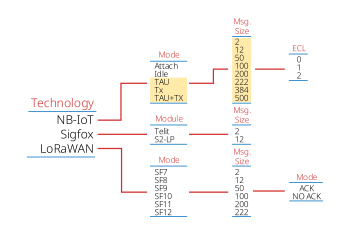

# Power Consumption Calculator

## Main Functionality
The application calculates the power consumption of the communication module from the loaded electric current samples. Based on the input parameters, the application employs a trapezoidal numerical integration to derive the power consumption in Joules and Ws. The calculator comes with a set of preloaded measurement samples, which can be selected via the drop-down menus.

### Input Parameters/Elements (Red Circles)
1. A drop-down menu for selecting required technology. The system currently contains pre-loaded samples for NB-IoT, Sigfox, and LoRaWAN.
2. A drop-down menu for selecting the operating mode or, in the case of Sigfox, the communication module.
3. A drop-down menu for selecting message sizes. This option is not available for all modes as some of them are not intended for the user payload transmissions.
4. For the NB-IoT technology case, this drop-down menu allows selecting the ECL (Extended Coverage Level) class. In the case of LoRaWAN, this drop-down menu defines if acknowledged communication is used.
5. After pressing this button, the selected measurement samples are loaded from the filesystem.
6. Via this slider, it is possible to set from which time value the power consumption is calculated. The red vertical line also visualizes the specified time.
7. Via this slider, it is possible to set until which time value the power consumption is calculated. The red vertical line also visualizes the specified time.

### Output Values/Elements (Blue Circles)
1. This label shows the calculated power consumption in Joules and Ws.
2. Output figure showing the electric current samples over time.

### Menu Structure
The content of drop-down menus is dynamically changed based on the selected values. Thus, the following image outlines the values in the menu for each input selection.

